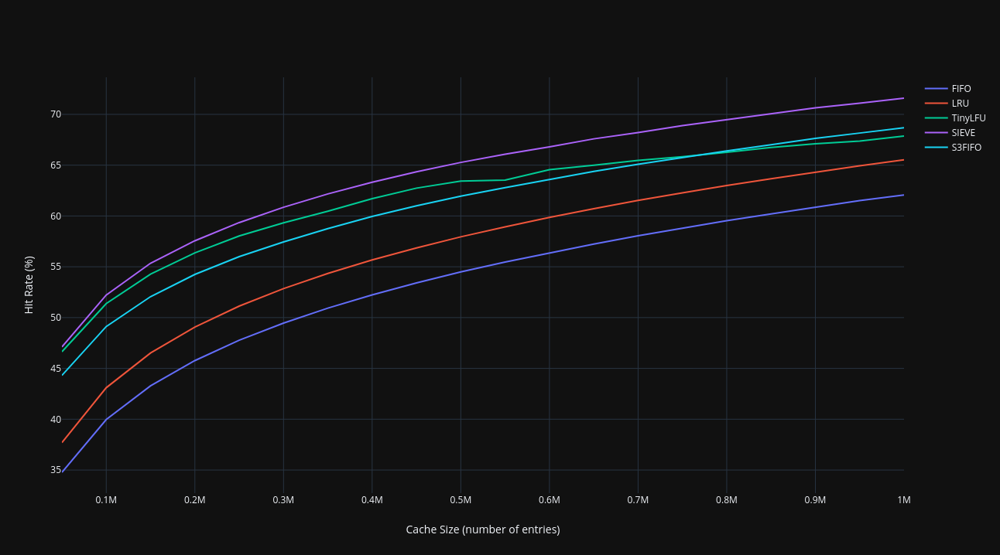
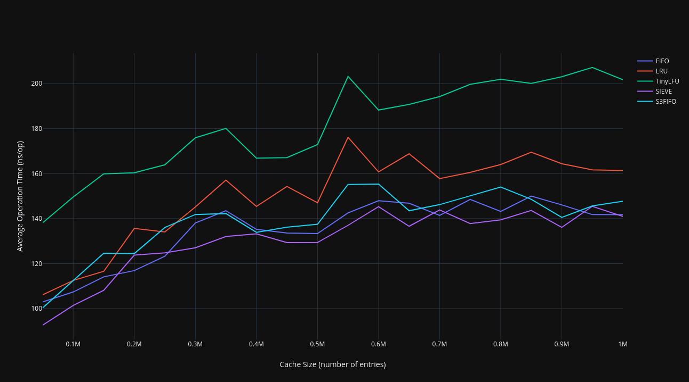
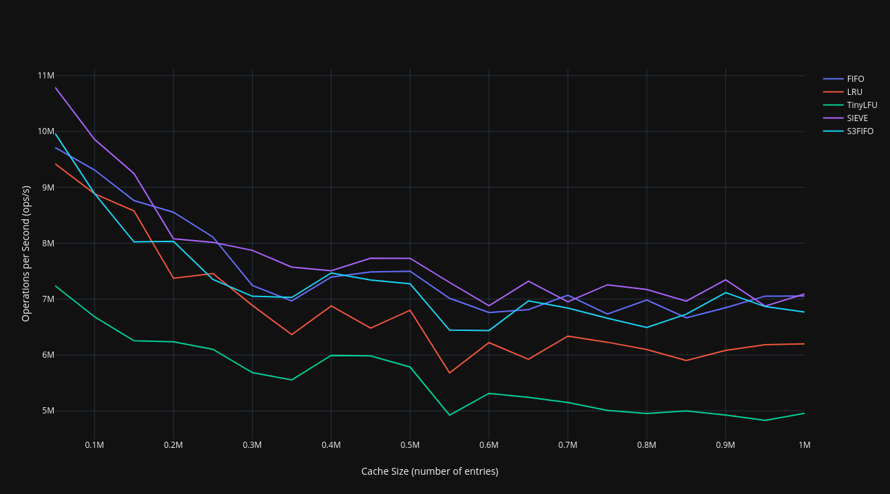
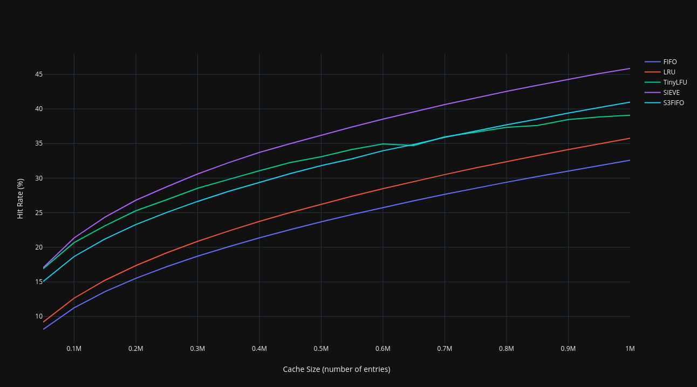
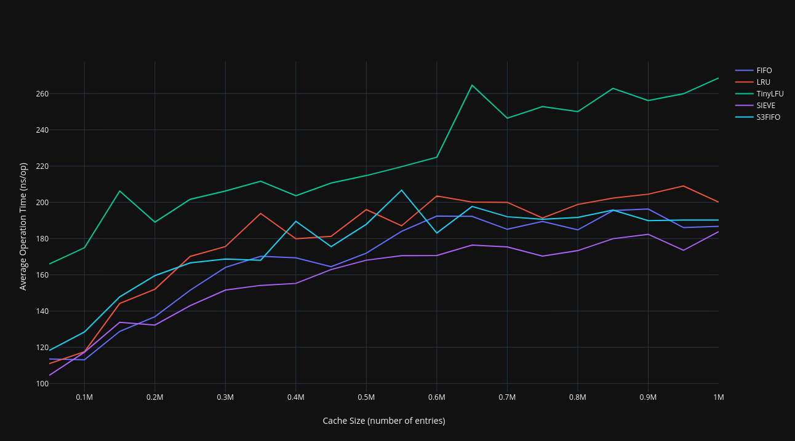
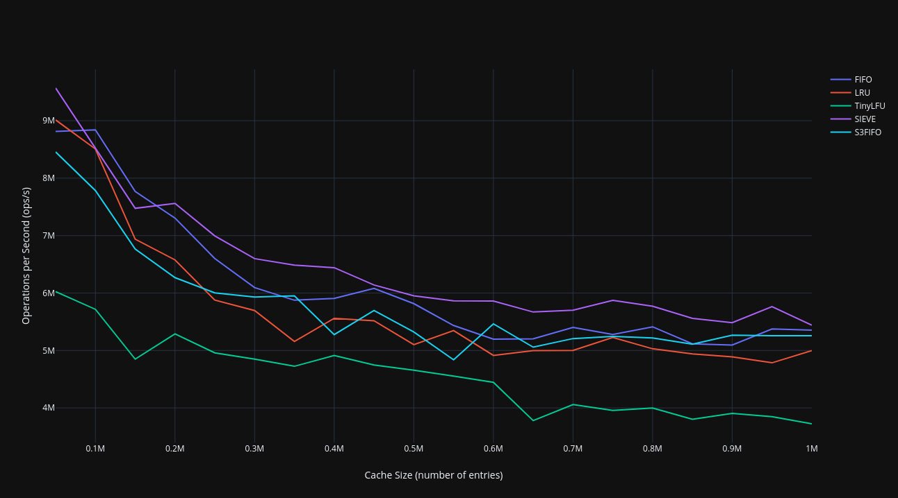

<h1 align="center">
    <picture>
      
    </picture>
  <br>
  <a href="https://github.com/jaxron/zigache/blob/main/LICENSE.md">
    
  </a>
  <a href="https://github.com/jaxron/zigache/actions/workflows/ci.yml">
    
  </a>
  <a href="https://jaxron.me/zigache/">
    
  </a>
  <a href="https://github.com/jaxron/zigache/issues">
    
  </a>
</h1>

<p align="center">
  <em><b>Zigache</b> is an efficient caching library built in <a href="https://ziglang.org/">Zig</a>, offering customizable cache eviction policies for various application needs.</em>
</p>

---

> [!IMPORTANT]
> Zigache is currently in **early development** and follows Zig's latest build in the master branch.

# 📚 Table of Contents

- [🚀 Features](#-features)
- [⚡️ Quickstart](#%EF%B8%8F-quickstart)
- [👀 Examples](#-examples)
- [⚙️ Configuration](#%EF%B8%8F-configuration)
- [📊 Benchmarks](#-benchmarks)
- [🗺️ Roadmap](#%EF%B8%8F-roadmap)
- [📄 License](#-license)
- [❓ FAQ](#-faq)

# 🚀 Features

Zigache offers a rich set of features to designed to meet various caching needs:

- **Multiple Eviction Algorithms:**
  - W-TinyLFU | [TinyLFU: A Highly Efficient Cache Admission Policy](https://arxiv.org/abs/1512.00727)
  - S3-FIFO | [FIFO queues are all you need for cache eviction](https://dl.acm.org/doi/10.1145/3600006.3613147)
  - SIEVE | [SIEVE is Simpler than LRU: an Efficient Turn-Key Eviction Algorithm for Web Caches](https://www.usenix.org/conference/nsdi24/presentation/zhang-yazhuo)
  - LRU | Least Recently Used
  - FIFO | First-In-First-Out
- **Extensive Configuration Options:**
  - Configurable cache size with pre-allocation for performance tuning
  - Ability to fine-tune cache policies (e.g., TinyLFU, S3FIFO)
  - Time-To-Live (TTL) support to expire cache entries
  - Thread safety and sharding settings for concurrent environments
  - Adjustable max load factor for the cache
- **Heavy Testing and Benchmarking** for [stability and performance](#-benchmarks) under various workloads

# ⚡️ Quickstart

To use Zigache in your project, follow these steps:

1. Run this command in your project's root directory:

    ```sh
    zig fetch --save git+https://github.com/jaxron/zigache.git
    ```

2. In your `build.zig`, add:

    ```diff
    pub fn build(b: *std.Build) void {
        // Options
        const target = b.standardTargetOptions(.{});
        const optimize = b.standardOptimizeOption(.{});

        // Build
    +   const zigache = b.dependency("zigache", .{
    +       .target = target,
    +       .optimize = optimize,
    +   }).module("zigache");
    
        const exe = b.addExecutable(.{
            .name = "your-project",
            .root_source_file = b.path("src/main.zig"),
            .target = target,
            .optimize = optimize,
        });
    +   exe.root_module.addImport("zigache", zigache);
 
        b.installArtifact(exe);
    
        const run_cmd = b.addRunArtifact(exe);
        run_cmd.step.dependOn(b.getInstallStep());
    
        const run_step = b.step("run", "Run the program");
        run_step.dependOn(&run_cmd.step);
    }
    ```

3. Now you can import and use Zigache in your code like this:

    ```zig
    const std = @import("std");
    const Cache = @import("zigache").Cache;
    
    pub fn main() !void {
        var gpa: std.heap.GeneralPurposeAllocator(.{}) = .init;
        defer _ = gpa.deinit();
        const allocator = gpa.allocator();
    
        // Create a cache with string keys and values
        var cache: Cache([]const u8, []const u8, .{}) = try .init(allocator, .{
            .cache_size = 1,
            .policy = .SIEVE,
        });
        defer cache.deinit();
    
        // your code...
    }
    ```

# 👀 Examples

Explore the usage scenarios in our examples directory:

- [01 | Key Types](examples/01_key_types.zig)
- [02 | TTL Entries](examples/02_ttl_entries.zig)

To run an example:

```sh
zig build [example-id]
zig build 01
```

# ⚙️ Configuration

Zigache offers flexible configuration options to adjust the cache to your needs:

```zig
var cache: Cache([]const u8, []const u8, .{
    .thread_safety = true,     // Enable thread safety for multi-threaded environments
    .ttl_enabled = true,       // Enable Time-To-Live (TTL) functionality
    .max_load_percentage = 60, // Set maximum load factor for the cache (60% occupancy)
}) = try .init(allocator, .{
    .cache_size = 10000,       // Maximum number of items the cache can store
    .pool_size = 1000,         // Pre-allocated nodes to optimize performance
    .shard_count = 16,         // Number of shards for concurrent access handling
    .policy = .SIEVE,          // Eviction policy in use
});
```

> For more detailed information, refer to the [full documentation](https://jaxron.me/zigache/).

# 📊 Benchmarks

This benchmark uses a [Zipfian distribution](https://en.wikipedia.org/wiki/Zipf%27s_law), run on an Intel® Core™ i7-8700 CPU, using commit `7a12b1f` of this library.

> [!NOTE]
> These results are not conclusive, as performance depends on workload and environment. These benchmarks are comparing eviction policies within this library, and not comparisons with other languages or libraries. You can customize the benchmarks using various flags. For details, run `zig build -h`.

<details>
<summary>Single Threaded (zipf 0.9, 10m keys)</summary>

## Benchmark Parameters

```sh
zig build bench -Doptimize=ReleaseFast
```

or

```sh
zig build bench -Doptimize=ReleaseFast -Dreplay=true -Dshards=1 -Dthreads=1 -Dauto='20:50000' -Dzipf='0.9' -Dkeys=10000000 -Dduration=10000
```

## Results

### Hit Rate (%)

<picture>
  
</picture>

### Average Operation Time (ns/op)

<picture>
  
</picture>

### Operations per Second (ops/s)

<picture>
  
</picture>

</details>

<details>
<summary>Single Threaded (zipf 0.7, 10m keys)</summary>

## Benchmark Parameters

```sh
zig build bench -Doptimize=ReleaseFast -Dzipf='0.7'
```

or

```sh
zig build bench -Doptimize=ReleaseFast -Dreplay=true -Dshards=1 -Dthreads=1 -Dauto='20:50000' -Dzipf='0.7' -Dkeys=10000000 -Dduration=10000
```

## Results

### Hit Rate (%)

<picture>
  
</picture>

### Average Operation Time (ns/op)

<picture>
  
</picture>

### Operations per Second (ops/s)

<picture>
  
</picture>

</details>

# 🗺️ Roadmap

Zigache is in its early stages. Our main priority is on implementing features, with performance improvements as a secondary priority. Here are some things we have planned for the future:

- [ ] 🧪 Improved benchmarking suite
- [ ] ⚙️ Runtime-configurable API
- [ ] 📦 Batch operations support
- [ ] 📊 Metrics and monitoring
- [X] 🔄 Configuration to adjust eviction policies
- [ ] 🔓 Lock-free data structures
- [ ] 📚 More extensive examples
- [ ] ⚡️ Async (non-blocking) I/O operations

> 💡 **We value your input!** Have suggestions for our roadmap? Feel free to open an issue or start a discussion.

# 📄 License

This project is licensed under the MIT License. See the [LICENSE.md](LICENSE.md) file for details.

# ❓ FAQ

<details>
  <summary><b>Is Zigache production-ready?</b></summary>
  <p>Zigache is currently in early development. Although it has been tested and benchmarked, it may not yet be suitable for all production environments. If you decide to use it in a production setting, please report any problems you encounter.</p>
</details>

<details>
  <summary><b>Which eviction policy should I choose?</b></summary>
  <p>It depends on your use case:
    <ul>
      <li><b>SIEVE</b>: Best for high throughput and high hit rate. (recommended)</li>
      <li><b>TinyLFU</b>: Best for customizability and high hit rate.</li>
      <li><b>S3FIFO</b>: Decent throughput with a decent hit rate.</li>
      <li><b>LRU</b>: Reliable for standard needs but falls behind compared to other options.</li>
      <li><b>FIFO</b>: High throughput, but lowest hit rates.</li>
    </ul>
  </p>
</details>

<details>
  <summary><b>Can I use Zigache in a multi-threaded environment?</b></summary>
  <p>Yes, Zigache supports thread-safe operations and sharding. Sharding reduces contention and there are plans to improve performance further in the future.</p>
</details>

<details>
  <summary><b>What type of keys does Zigache support?</b></summary>
  <p>Zigache supports most key types like strings, integers, structs, arrays, pointers, enums, and optionals. However, floats are not supported due to precision issues.</p>
</details>

<details>
  <summary><b>How can I contribute to Zigache?</b></summary>
  <p>We welcome contributions! Please follow the <a href="https://ziglang.org/documentation/master/#Style-Guide">Zig Style Guide</a> and ensure that your changes include appropriate tests.</p>
</details>
